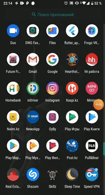

# 

### Project Overview
It uses [News API](https://newsapi.org/) to get news and get JSON data back. Then it is parsed using Moshi library and the requests are sent by Retrofit2.

### API Key Note
You need to insert your API key.
1. Visit [NewsAPI.org](https://newsapi.org/register) to get your API Key
2. Copy your API Key from accounts section
3. Open `gradle.properties` *(Create the file if not exists)*
   - For Windows: `C:\Users\<UserName>\.gradle\gradle.properties`
   - Add the following line:
    ```
    API_KEY="YOUR_API_KEY"
    ``` 
    
#### Demo


### Features

* Navigation Drawer
* Fragments
* ViewPager2 plus TabLayout
* Coroutines
* ViewModel
* Livedata
* DataBinding
* Room
* WorkManager
* Retrofit
* News API
* Circleimageview
* JSON Parsing
* Glide
* CardView
* RecyclerView
* ConstraintLayout

### Screenshots
   

   


    
#### Libraries
- [Moshi](https://github.com/square/moshi) For parsing JSON data
- [Retrofit](http://square.github.io/retrofit/) For sending network requests
- [Glide](https://github.com/bumptech/glide) Loading and caching images
- [Room, LiveData and ViewModel, WorkManager, Viewpager2, Navigation Component](https://developer.android.com/topic/libraries/architecture/) Latest Android Architecture components
- [Databinding](https://developer.android.com/topic/libraries/data-binding/) Binding data and reducing 100s of Lines of Code
- [Kotlin Coroutines](https://developer.android.com/kotlin/coroutines) Manage long-running tasks that might otherwise block the main thread and cause your app to freeze
- [MVVM](https://developer.android.com/jetpack/docs/guide) Recommended app architecture
